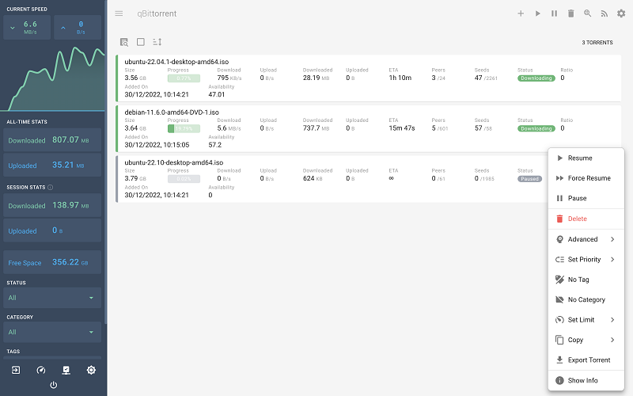
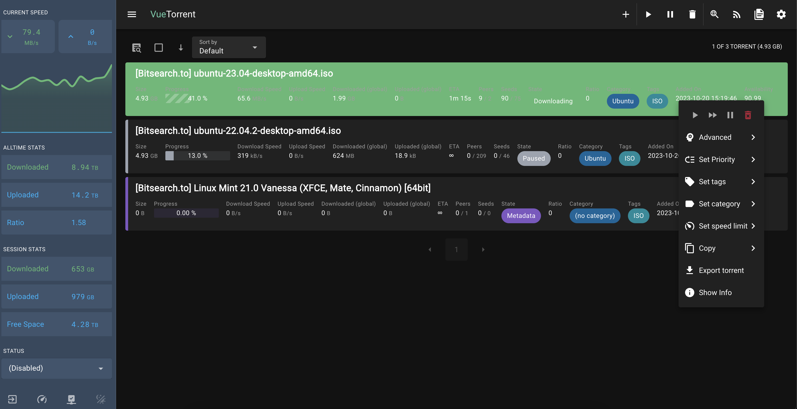

  
  <h1>VueTorrent</h1>
  
The sleekest looking WebUI for qBittorrent made with Vue.js!

Join us on [Discord](https://discord.gg/KDQP7fR467)

 

 
 
 
 

## Screenshots

- Desktop

  

- Desktop Dark Mode

  

- Mobile Dark Mode

  
   

## Installation

### Manual

- Visit the [Releases](https://github.com/WDaan/VueTorrent/releases) page!
- Download the latest `vuetorrent.zip`
- Unzip the downloaded file
- Point your alternate WebUI location to the `vuetorrent` folder in qBittorrent settings

### From Source

- Clone branch using
  - `git clone --single-branch --branch latest-release https://github.com/WDaan/VueTorrent.git`
- Pull changes every once in a while, using `git pull`

If you like to always have the latest and greatest, please sync to the `nightly-release`-branch. This can contain breaking changes though.

### Lazy/Easy

- use [hotio's qbittorrent](https://hotio.dev/containers/qbittorrent/) docker image, that comes pre-packed with VueTorrent.

[Alternative methods - May work for older QBit versions](../../wiki/Alternative_Installation_Methods)

## Development

- Clone the repo
- `npm install`
- `npm start`
- `npm run lint` (to format the code)
- `docker-compose up -d` (starts a qbittorrent docker, optional)
- Open the WebUI on localhost with the default credentials
  - Default username is always `admin`
  - Default password is `adminadmin` **on 4.6.0 and below**, and is generated on 4.6.1 and above
- Make sure "CSRF protection" and "Host header verification" is disabled on the target server!
- Edit `env.development` to tweak your dev environment (e.g. fake torrents)

## Features

- Torrents
  - add / remove / pause / resume / rename torrents
  - selectively download files
  - view info / trackers / peers / content / tags & categories
  - search for new torrents straight from the WebUI!
  - search filtering powered by Fuse.js!
- Keyboard shortcuts!
  - Mac keymap is supported (use <kbd>Cmd</kbd> instead of <kbd>Ctrl</kbd>)
  - Press <kbd>Escape</kbd> to dismiss any dialogs or to return to Dashboard view
  - Dashboard
    - Select all torrents with <kbd>Ctrl</kbd>-<kbd>A</kbd>
    - Focus search input with <kbd>Ctrl</kbd>-<kbd>F</kbd>
      - Press again to enable native browser search
    - When no dialogs are opened, press <kbd>Escape</kbd> to unfocus search input
      - Press again to unselect all torrents
    - Delete selected torrents with <kbd>Delete</kbd> (<kbd>Fn</kbd>-<kbd>Backspace</kbd> on Mac)
    - <kbd>Ctrl</kbd>-click on a torrent card to enable multi-select mode and select it
    - Hold <kbd>Shift</kbd> and click on a torrent card to select all torrents between the last selected torrent and the clicked torrent
- System
  - see session stats (down / upload speed, session uploaded / downloaded, free space)
  - beautiful transfer graphs
  - change the most common settings
- Extra features the default WebUI doesn't have
  - mobile friendly! (can be installed as a PWA)
  - Configureable Dashboard: choose which torrent properties are shown for both busy and completed torrents
- Optimized for the latest version of qBittorrent

## Contributing

I'll gladly accept help/pull requests & advice!

[FAQ](../../wiki/FAQ)

### Localize the app

We use [Tolgee](https://tolgee.io/) to manage translations. If you want to help, let us know which locale do you want to work on in the discord server to be added to the project.

## Support

Open up an issue 😛

but before you do that:

- confirm you're on the latest version of VueTorrent
- confirm there is no other issue mentioning the same problem

## Contributors

- [@m4ximuel](https://github.com/m4ximuel)
- [@Larsluph](https://github.com/Larsluph)
