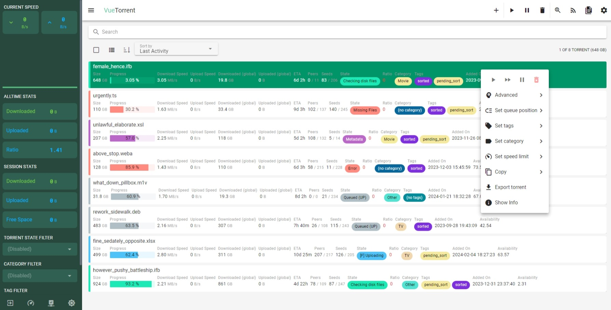
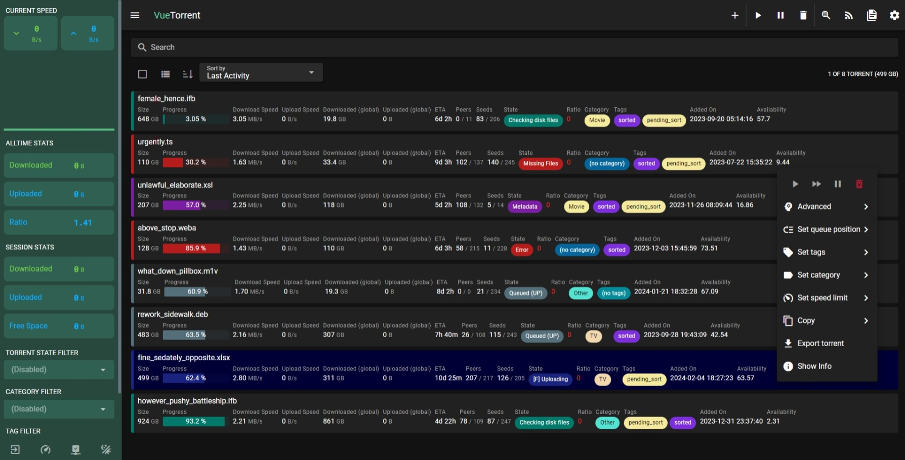
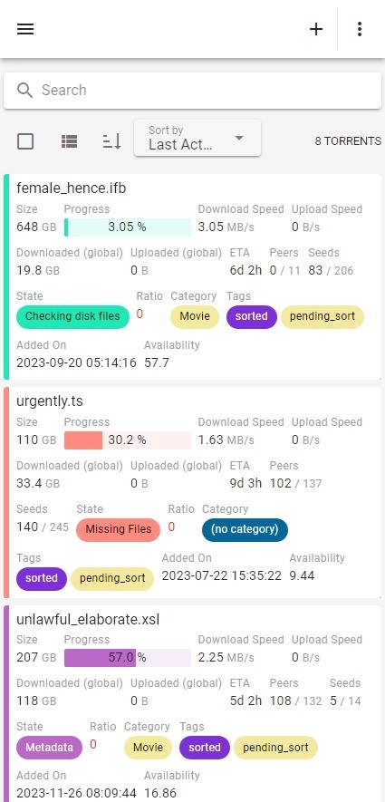
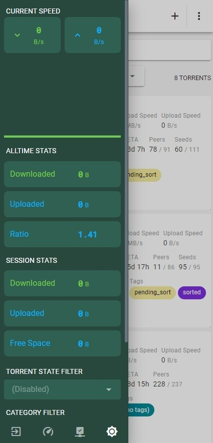
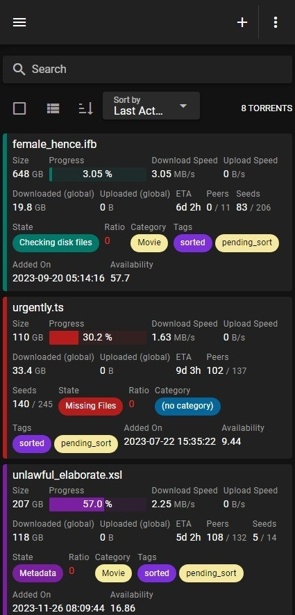
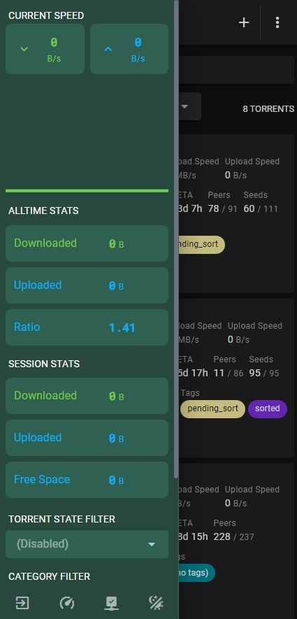

# VueTorrent

The sleekest looking WebUI for qBittorrent made with Vue.js!

 

 
 
 

## Screenshots

- Desktop

  

- Desktop Dark Mode

  

- Mobile Light Mode

  
   

- Mobile Dark Mode

  
   

## Demo

A live demo **with mocked data** is available here: <https://vuetorrent.github.io/demo>

<!-- prettier-ignore -->
> [!NOTE]
> This version isn't connected to a qBittorrent instance.
>
> Don't try to download torrents or change preferences, it won't work 😉

## Installation

Checkout the [wiki](https://github.com/VueTorrent/VueTorrent/wiki/Installation)!

## Development

- Clone the repo
- `npm install`
- `npm start`
- `npm run lint` (to check for problems in code)
- `npm run lint:fix` (to fix common problems)
- `docker-compose up -d` (starts a qbittorrent docker, optional)
- Open the WebUI on localhost with the default credentials
  - See [#1720](https://github.com/VueTorrent/VueTorrent/issues/1720) for more details
- Make sure WebUI > "Host header validation" is disabled in the qBittorrent preferences
- Edit `env.development` to tweak your dev environment (e.g. mocked data)

## Features

- Torrents
  - add / remove / pause / resume / rename torrents
  - selectively download files
  - view info / trackers / peers / content / tags & categories
  - search for new torrents straight from the WebUI!
- Keyboard shortcuts!
  - Mac keymap is supported (use <kbd>Cmd</kbd> instead of <kbd>Ctrl</kbd>)
  - Press <kbd>Escape</kbd> to dismiss any dialogs or to return to Dashboard view
  - Dashboard
    - Select all torrents with <kbd>Ctrl</kbd>-<kbd>A</kbd>
    - Focus search input with <kbd>Ctrl</kbd>-<kbd>F</kbd>
      - Press again to enable native browser search
    - When no dialogs are opened, press <kbd>Escape</kbd> to unfocus search input
      - Press again to unselect all torrents
    - Delete selected torrents with <kbd>Delete</kbd> (<kbd>Fn</kbd>-<kbd>Backspace</kbd> on Mac)
    - <kbd>Ctrl</kbd>-click on a torrent card to enable multi-select mode
    - Hold <kbd>Shift</kbd> and click on a torrent card to select all torrents between the last selected torrent and the clicked torrent
- System
  - see session stats (down / upload speed, session uploaded / downloaded, free space)
  - beautiful transfer graphs
  - change the most common settings
- Extra features the default WebUI doesn't have
  - mobile friendly! (can be installed as a PWA)
  - Configureable Dashboard: choose which torrent properties are shown for both busy and completed torrents
- Optimized for the latest version of qBittorrent
- Additional backend for improved experience, [see the repo for more info](https://github.com/VueTorrent/vuetorrent-backend)
  - This is a work in progress, and is not required to use VueTorrent
  - Stores server-side settings
- Supports [qBittorrent Enhanced Edition](https://github.com/c0re100/qBittorrent-Enhanced-Edition) preferences

## Important Information

VueTorrent is a **WebUI** (think of it as a "visual skin") that uses qBittorrent's WebAPI, enabling full compatibility with automation solutions like the *arr stack.

Everything that is compatible with the classic qBittorrent WebUI will work regardless of the WebUI you chose to use, whether its VueTorrent or another one.

## Contributing

We gladly accept contributions!

Any help is appreciated, whether it's reporting bugs, suggesting enhancements, contributing code or localizing the app.

See the [Contributing Guidelines](https://github.com/VueTorrent/VueTorrent/blob/master/.github/CONTRIBUTING.md) for more information.

## Support

- 
- 
- 

If any of the above didn't help, feel free to open an issue!

See the [Contributing Guidelines](https://github.com/VueTorrent/VueTorrent/blob/master/.github/CONTRIBUTING.md) for more information.

## Funding

All donations are appreciated but purely optional.

Checkout the sponsor section of the repository.

## Contributors

- [@m4ximuel](https://github.com/m4ximuel)
- [@Larsluph](https://github.com/Larsluph)
